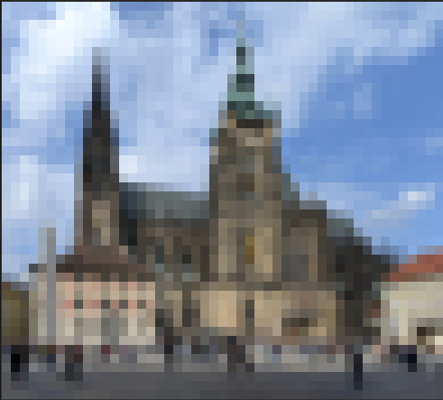
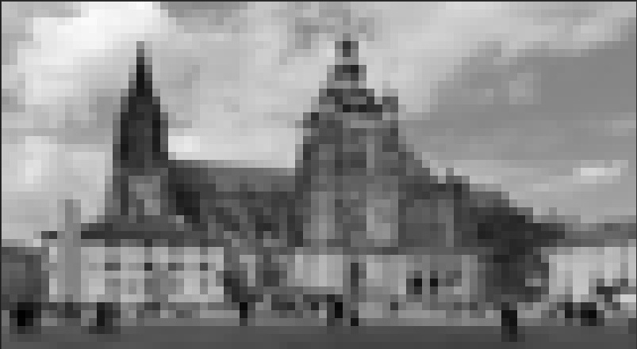

# About
`tiv-rs` is terminal image viewer (tiv) written in Rust inspired by [TerminalImageViewer](https://github.com/stefanhaustein/TerminalImageViewer/tree/master).

This project is result of my love to ascii art and procrastination during my experiments with machine learning.

# Features
Shows:
- **animation** (for GIF)
- **static image** (other formats)
using 8-bit color encoding.

Image can be scale according terminal size to:
- **fit** - fits image to termial area; preserves aspect ratio,
- **cropped to fill** - crops image to fill whole terminal area; preserves aspect ratio,
- **scale to fill** - scales image to fille whole terminal area.

Image can be shown in color (8-bit RGB) or gray (8-bit) pallete.

# How to use
Call tiv-rs with path to image file you want to visualize, e.g. table below:

command | result
---|---
`./tiv-rs 1024px-St_Vitus_Prague_September_2016-21.jpg` | 
`./tiv-rs 1024px-St_Vitus_Prague_September_2016-21.jpg s G` | 

# Implementation
Reads image and scales it to resolution `terminal width` x 2 * `terminal height`. Than transforms image to 8-bit RGB or 8-bit grayscale image and stores it as 2D array (Array2). Finally it iterates throgh rows of pixels with step 2, so it takes pair of subsequent rows and transforms each pixel pair from these to character `▄`, so first of the pair defines background and second foreground color. This way, each character in output represents two subsequent pixels in vertical axis.

# Dependencies
Uses [`termion`](https://docs.rs/termion/latest/termion/) crate for get size of terminal, [`image`](https://docs.rs/image/latest/image/) crate for reading and processing of image, [`ndarray`](https://docs.rs/ndarray/latest/ndarray/) crate for easier iteration over pixels (not really necessery) and [`ansi_term`](https://docs.rs/ansi_term/latest/ansi_term/) crate for coloring characters in terminal (the main thing).

# Testing
Tested on files in table below:
file | type | OS
---|---|---
[St. Vitus Catedral on Prague castle](https://en.wikipedia.org/wiki/Prague_Castle#/media/File:St_Vitus_Prague_September_2016-21.jpg) | JPG | Pop!_OS 22.04
[Rotating Earth](https://en.wikipedia.org/wiki/GIF#/media/File:Rotating_earth_(large).gif) | GIF | Pop!_OS 22.04