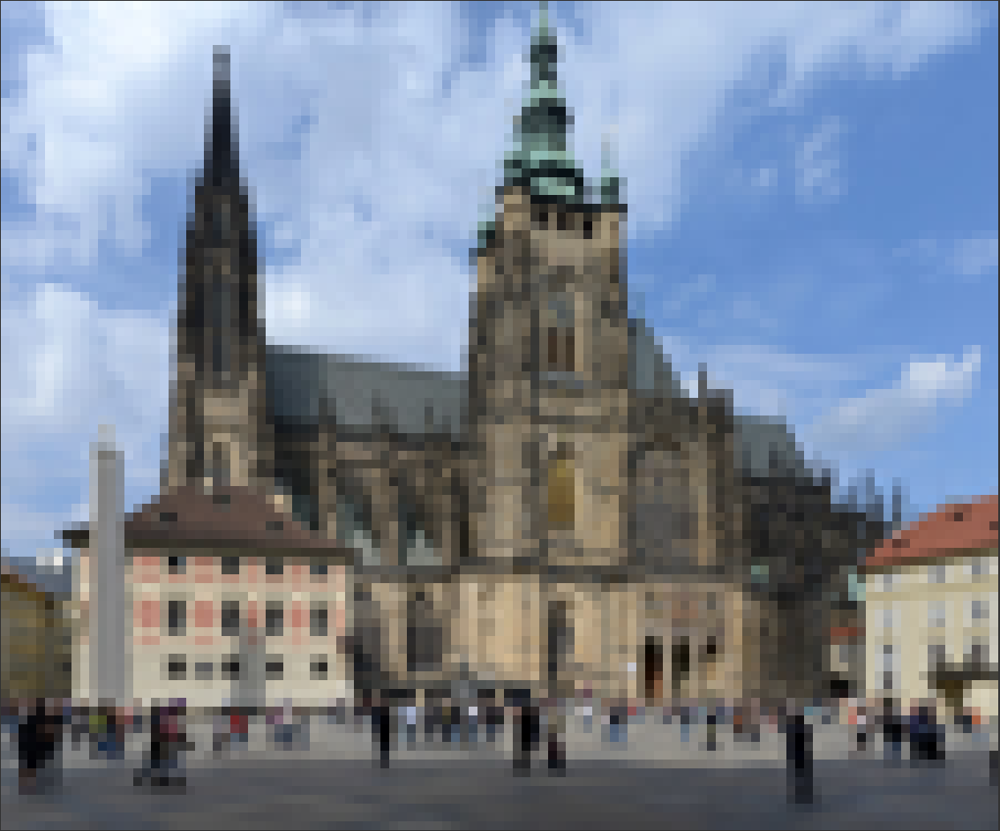

# About
`tiv-rs` is terminal image viewer (tiv) written in Rust inspired by [TerminalImageViewer](https://github.com/stefanhaustein/TerminalImageViewer/tree/master).

This project is result of my love to ascii art and procrastination during my experiments with machine learning.

# How to use
Call tiv-rs with path to image file you want to visualize, e.g.:
```bash
./tiv-rs 1024px-St_Vitus_Prague_September_2016-21.jpg
```

# Implementation
Reads image and scales it to resolution `terminal width` x 2 * `terminal height`. Than transforms image to 8-bit RGB or 8-bit grayscale image and stores it as 2D array (Array2). Finally it iterates throgh rows of pixels with step 2, so it takes pair of subsequent rows and transforms each pixel pair from these to character `▄`, so first of the pair defines background and second foreground color. This way, each character in output represents two subsequent pixels in vertical axis.

# Dependencies
Uses [`termion`](https://docs.rs/termion/latest/termion/) crate for get size of terminal, [`image`](https://docs.rs/image/latest/image/) crate for reading and processing of image, [`ndarray`](https://docs.rs/ndarray/latest/ndarray/) crate for easier iteration over pixels (not really necessery) and [`ansi_term`](https://docs.rs/ansi_term/latest/ansi_term/) crate for coloring characters in terminal (the main thing).

# Testing
Tested on Pop!_OS 22.04 with image of [St. Vitus Catedral on Prague castle](https://en.wikipedia.org/wiki/Prague_Castle#/media/File:St_Vitus_Prague_September_2016-21.jpg). See result below:
